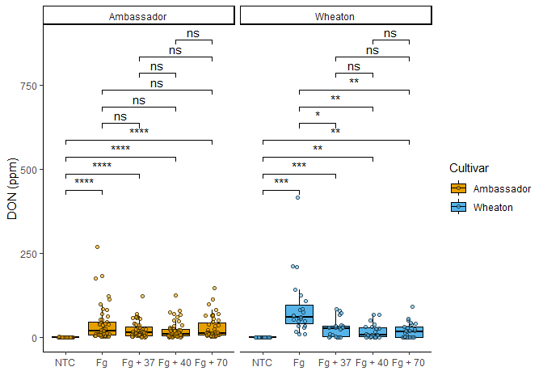
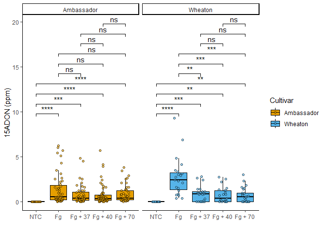
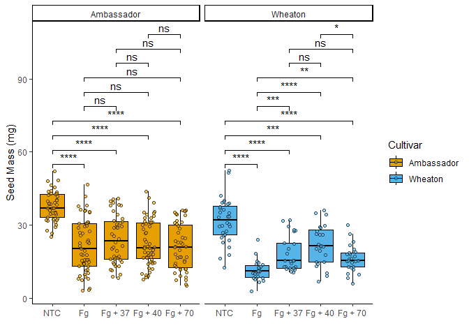
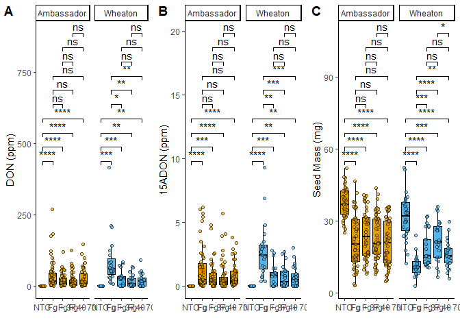

``` r
library(knitr)
```

    ## Warning: package 'knitr' was built under R version 4.4.2

``` r
library(ggplot2)
library(markdown)
```

    ## Warning: package 'markdown' was built under R version 4.4.2

# Question 1

**Explain a YAML Header:** A header that lists the title, author, date,
and output formats for the markdown.

**Explain Literate Programming:** Coding organized into small sections
to be more easily read.

# Question 2

#### Take the code you wrote for coding challenge 3, question 5, and incorporate it into your R markdown file.

Data from Noel, Z.A., Roze, L.V., Breunig, M., Trail, F. 2022.
Endophytic fungi as promising biocontrol agent to protect wheat from
Fusarium graminearum head blight. Plant Disease.
<https://doi.org/10.1094/PDIS-06-21-1253-RE>

### Individual Graphs

``` r
# Load in Libraries
library(tidyverse)
```

    ## Warning: package 'tidyverse' was built under R version 4.4.2

    ## Warning: package 'tidyr' was built under R version 4.4.2

    ## Warning: package 'readr' was built under R version 4.4.2

    ## Warning: package 'purrr' was built under R version 4.4.2

    ## Warning: package 'forcats' was built under R version 4.4.2

    ## Warning: package 'lubridate' was built under R version 4.4.2

    ## ── Attaching core tidyverse packages ──────────────────────── tidyverse 2.0.0 ──
    ## ✔ dplyr     1.1.4     ✔ readr     2.1.5
    ## ✔ forcats   1.0.0     ✔ stringr   1.5.1
    ## ✔ lubridate 1.9.4     ✔ tibble    3.2.1
    ## ✔ purrr     1.0.2     ✔ tidyr     1.3.1
    ## ── Conflicts ────────────────────────────────────────── tidyverse_conflicts() ──
    ## ✖ dplyr::filter() masks stats::filter()
    ## ✖ dplyr::lag()    masks stats::lag()
    ## ℹ Use the conflicted package (<http://conflicted.r-lib.org/>) to force all conflicts to become errors

``` r
library(ggpubr)
```

    ## Warning: package 'ggpubr' was built under R version 4.4.2

``` r
library(ggrepel)
```

    ## Warning: package 'ggrepel' was built under R version 4.4.2

``` r
# Make a color-blind friendly palette
cbbPalette <- c("#E69F00", "#56B4E9", "#009E73", "#F0E442", "#0072B2", "#D55E00", "#CC79A7", "#000000")

# Load in Data
myco <- read.csv("MycotoxinData.csv", header = TRUE, na.strings = "na")

# Reorder by Treatment Level
myco$Treatment <- factor(myco$Treatment, levels = c("NTC", "Fg", "Fg + 37", "Fg + 40", "Fg + 70"))

#### Graph the effects of DON by Treatment
myco.don.Q1 <- ggplot(myco, aes(x = Treatment, y = DON, color = Cultivar, fill = Cultivar)) +
  geom_boxplot(outlier.shape = NA, color = "black") +
  geom_point(aes(fill=Cultivar), pch=21, color = "black", 
             position=position_jitterdodge(dodge.width=0.85), alpha = 0.6) + 
  scale_color_manual(values = cbbPalette) +
  scale_fill_manual(values = cbbPalette) + 
  ylab("DON (ppm)") +
  xlab("") +
  theme_classic() +
  facet_wrap(~Cultivar)

myco.don.Q1
```

    ## Warning: Removed 8 rows containing non-finite outside the scale range
    ## (`stat_boxplot()`).

    ## Warning: Removed 8 rows containing missing values or values outside the scale range
    ## (`geom_point()`).

<!-- -->

``` r
### Graph the effects of X15ADON by Treatment
myco.don.Q3.1 <- ggplot(myco, aes(x = Treatment, y = X15ADON, color = Cultivar, fill = Cultivar)) +
  geom_boxplot(outlier.shape = NA, color = "black") +
  geom_point(aes(fill=Cultivar), pch=21, color = "black", 
             position=position_jitterdodge(dodge.width=0.85), alpha = 0.6) + 
  scale_color_manual(values = cbbPalette) +
  scale_fill_manual(values = cbbPalette) + 
  ylab("15ADON (ppm)") +
  xlab("") +
  theme_classic() +
  facet_wrap(~Cultivar)

myco.don.Q3.1
```

    ## Warning: Removed 10 rows containing non-finite outside the scale range
    ## (`stat_boxplot()`).

    ## Warning: Removed 10 rows containing missing values or values outside the scale range
    ## (`geom_point()`).

<!-- -->

``` r
### Graph the effects of MassperSeed_mg by Treatment
myco.don.Q3.2 <- ggplot(myco, aes(x = Treatment, y = MassperSeed_mg, color = Cultivar, fill = Cultivar)) +
  geom_boxplot(outlier.shape = NA, color = "black") +
  geom_point(aes(fill=Cultivar), pch=21, color = "black", 
             position=position_jitterdodge(dodge.width=0.85), alpha = 0.6) + 
  scale_color_manual(values = cbbPalette) +
  scale_fill_manual(values = cbbPalette) + 
  ylab("Seed Mass (mg)") +
  xlab("") +
  theme_classic() +
  facet_wrap(~Cultivar)

myco.don.Q3.2
```

    ## Warning: Removed 2 rows containing non-finite outside the scale range
    ## (`stat_boxplot()`).

    ## Warning: Removed 2 rows containing missing values or values outside the scale range
    ## (`geom_point()`).

<!-- -->

### T-Tests

``` r
# Question 1 + Ttest
myco.don.Q1.Ttest <- myco.don.Q1 + 
  geom_pwc(aes(group = Treatment), method = "t_test", label = "{p.adj.signif}")

myco.don.Q1.Ttest
```

    ## Warning: Removed 8 rows containing non-finite outside the scale range
    ## (`stat_boxplot()`).

    ## Warning: Removed 8 rows containing non-finite outside the scale range
    ## (`stat_pwc()`).

    ## Warning: Removed 8 rows containing missing values or values outside the scale range
    ## (`geom_point()`).

<!-- -->

``` r
# Question 3 - 15ADON + Ttest
myco.don.Q3.1.Ttest <- myco.don.Q3.1 + 
  geom_pwc(aes(group = Treatment), method = "t_test", label = "{p.adj.signif}")

myco.don.Q3.1.Ttest
```

    ## Warning: Removed 10 rows containing non-finite outside the scale range
    ## (`stat_boxplot()`).

    ## Warning: Removed 10 rows containing non-finite outside the scale range
    ## (`stat_pwc()`).

    ## Warning: Removed 10 rows containing missing values or values outside the scale range
    ## (`geom_point()`).

<!-- -->

``` r
# Question 3 - MassperSeed_mg + Ttest

myco.don.Q3.2.Ttest <- myco.don.Q3.2 + 
  geom_pwc(aes(group = Treatment), method = "t_test", label = "{p.adj.signif}")

myco.don.Q3.2.Ttest
```

    ## Warning: Removed 2 rows containing non-finite outside the scale range
    ## (`stat_boxplot()`).

    ## Warning: Removed 2 rows containing non-finite outside the scale range
    ## (`stat_pwc()`).

    ## Warning: Removed 2 rows containing missing values or values outside the scale range
    ## (`geom_point()`).

<!-- -->

### Combined Figure

``` r
myco.don.Ttest <- ggarrange(
  myco.don.Q1.Ttest,  # First plot: Q1 Ttest
  myco.don.Q3.1.Ttest,  # Second plot: Q3.1 Ttest
  myco.don.Q3.2.Ttest,  # Third plot: Q3.2 Ttest
  labels = "AUTO",  # Automatically label the plots (A, B, C, etc.)
  nrow = 1,  # Arrange the plots in 3 rows
  ncol = 3,  # Arrange the plots in 1 column
  legend = FALSE  # Do not include a legend in the combined figure
)
```

    ## Warning: Removed 8 rows containing non-finite outside the scale range
    ## (`stat_boxplot()`).

    ## Warning: Removed 8 rows containing non-finite outside the scale range
    ## (`stat_pwc()`).

    ## Warning: Removed 8 rows containing missing values or values outside the scale range
    ## (`geom_point()`).

    ## Warning: Removed 10 rows containing non-finite outside the scale range
    ## (`stat_boxplot()`).

    ## Warning: Removed 10 rows containing non-finite outside the scale range
    ## (`stat_pwc()`).

    ## Warning: Removed 10 rows containing missing values or values outside the scale range
    ## (`geom_point()`).

    ## Warning: Removed 2 rows containing non-finite outside the scale range
    ## (`stat_boxplot()`).

    ## Warning: Removed 2 rows containing non-finite outside the scale range
    ## (`stat_pwc()`).

    ## Warning: Removed 2 rows containing missing values or values outside the scale range
    ## (`geom_point()`).

``` r
myco.don.Ttest
```

<!-- -->
